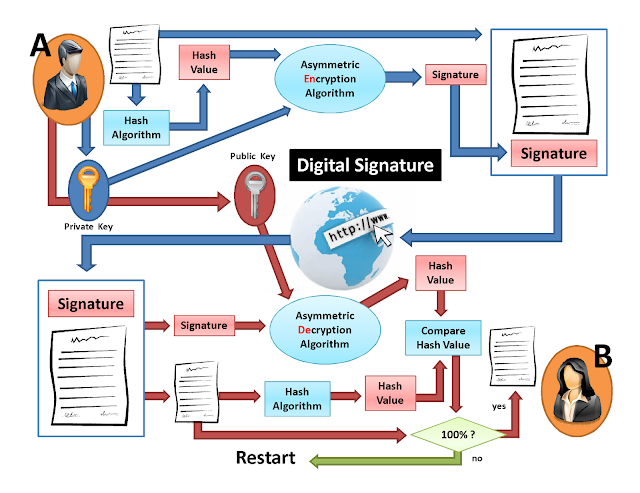

# กระบวนการทำลายเซ็นต์ดิจิตอล (Digital Signature Methodology)

# กระบวนการทางฝั่งผู้ส่ง

1. จากภาพ  นาย A ต้องการส่งเอกสาร (Document) ให้กับนางสาว B  
2. ระบบจะนำเอกสารที่นาย A ต้องการจะส่งมาทำการหาค่า Hash Value ด้วย Hash Algorithm
3. จากนั้นก็จะนำ Hash Value ที่หามาได้จากข้อ 2 มาเข้ารหัสแบบ Asymmetric ด้วย Private Key ของ นาย A (ของผู้ส่ง) จะได้เป็นลายเซ็นดิจิตอล (Signature)
4. จากนั้นก็ส่ง Signature ไปพร้อมกับ Document ชุดเดิม

### ข้อสังเกต
1. เอกสาร (Document) `ไม่มี`การเข้ารหัสใด ๆ ทั้งสิ้น
2. การเข้ารหัส Hash Value จะใช้ Private Key ของผู้ส่ง
แนบ Signature ส่งไปพร้อมกับ Document

# กระบวนการทางฝั่งผู้รับหรือกระบวนการตรวจสอบ

1. จากภาพนางสาว B จะได้ข้อมูลมาเป็น Signature + Document มาด้วยกัน
2. ระบบจะทำการแยก Signature และ Document ออกจากกัน
3. นำ Signature มาถอดรหัสแบบ Asymmetric ด้วย Public Key ของนาย A (ของผู้ส่ง ซึ่งระบบของนางสาว B หรือของผู้รับเป็นตัวจัดการ)  จะได้เป็น Hash Value
4. และนำ Document ที่ได้  มาทำการหา Hash Value ด้วย Hash Algorithm เดียวกันกับที่นาย A (ผู้ส่ง) ใช้ 
5. นำ Hash Value ของข้อ 3 และ ข้อ 4 มาเปรียบเทียบกัน  
6. ต้องเท่ากัน 100 % `เท่านั้น` จึงจะถือว่าข้อมูลนั้นสมบูรณ์  มิฉะนั้นแล้วต้องให้นาย A (ผู้ส่ง) ส่ง Document มาให้ใหม่  เพราะถือว่าอาจมีการแก้ไขเปลี่ยนแปลงข้อมูลระหว่างทาง

### ข้อสังเกต
1. การถอดรหัส Signature จะใช้ Public Key ของผู้ส่ง
2. และ Hash Value ของทั้ง 2 ที่หาได้ต้องเท่ากัน 100 % เท่านั้น  จึงจะถือว่าการส่งข้อมูลสมบูรณ์แบบ

# หมายเหตุ
เป็นบทความที่ถูกย้ายมาจาก [https://na5cent.blogspot.com/2012/04/digital-signature-methodology.html](https://na5cent.blogspot.com/2012/04/digital-signature-methodology.html) ซึ่งผู้เขียน เขียนไว้เมื่อ วันจันทร์ที่ 2 เมษายน พ.ศ. 2555