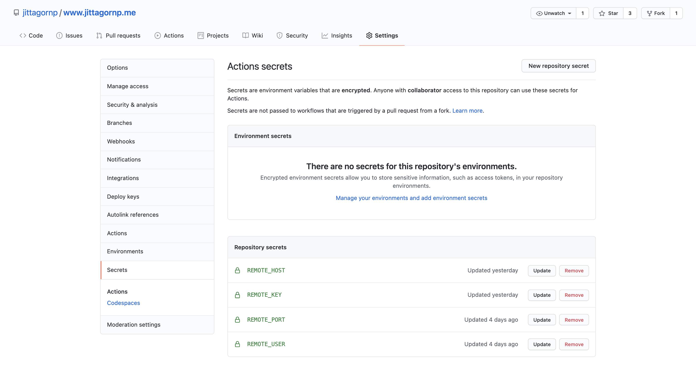

# ไหน ๆ ก็เป็น Developer แล้ว เรามาสร้าง Weblog (Blog) ใช้เองกันเถอะ!


> บทความนี้เขียนขึ้น เพราะอยากที่จะเชิญชวน Developer ทุกคน มาร่วมกันสร้าง Blog ของตัวเอง โดยใช้ Programming Language และ Technology ตามที่ตัวเองถนัด โดยไม่ใช้ Blog สำเร็จรูปที่มีอยู่แล้ว  

เราว่าการสร้าง Blog ด้วยตัวเอง มันบ่งบอกถึงตัวตนและ `Lifestyle` ของเราน่ะ     
รสนิยมของเราจะเป็นยังไง ส่วนนึงมันก็แสดงออกมาจากรูปแบบของ Blog และวิธีการเขียนบทความของเรานั่นแหล่ะ 

# ทำไมถึงสร้าง Blog เอง

เหตุผลหลัก ๆ คือ Blog สำเร็จรูปที่มีอยู่ `มันไม่ตอบโจทย์ที่ตัวเองอยากจะได้สักเท่าไหร่`   
ไม่ใช่ว่าของเค้าไม่ดีน่ะ หลาย ๆ อันดี ถึงดีมาก แต่แค่เราอยากได้อะไรตามใจตัวเองแค่นั้นแหล่ะ 

# ทำไม Blog ที่มีอยู่ถึงไม่ตอบโจทย์

อันนี้เหตุผลส่วนตัวน่ะ

1. เราอยากได้ Blog ที่มันดูสวย เรียบง่าย เป็น Blog ที่เขียนบทความแล้วน่าอ่าน (เราอยากให้คนอ่าน อ่านเพลิน) ซึ่งตรงนี้เราประทับใจ [Medium](https://medium.com) เอามาก ๆ เลยเป็นเหตุผลว่า ทำไม Blog นี้ถึงหน้าตาคล้าย Medium ใช่! เราลอก  Style ของ Medium มาเลย อันนี้ยอมรับ แล้วทำไมถึงไม่ใช้ Medium เลยล่ะ ลองอ่านเหตุผลถัด ๆ ไปดู    

2. `เราอยากได้สารบัญบทความ (Table of Contents)` คือ เคยเจอมั้ย ที่ต้องอ่านบทความยาว ๆ แล้วไม่รู้ว่ามันมีหัวข้ออะไรให้อ่านบ้าง  และเราอ่านถึงไหนแล้ว บางที บางอันเราเคยอ่านแล้ว เราก็อยากที่จะเลื่อนไปอ่านแค่บางหัวข้อแค่นั้น ไม่มีสารบัญนี่ไล่หาตาแตกเลย  

3. เราอยากเขียนบทความเป็น Markdown เก็บไว้ เพื่อที่ว่าจะได้เอาไปใช้กับ Platform อื่น ๆ ได้ด้วย เช่น GitHub, GitLab และ Plaform อื่น ๆ ที่ Support Markdown

4. เราเป็น Blogger มา 10 ปีล่ะ (หัดเขียนบทความตั้งแต่เรียนอยู่ปี 3) เคยลองเขียนบทความมาหลาย Platform ทั้ง Blogspot, Wordpress, GitHub Pages, Git Book, Medium, Dev และอื่น ๆ เราพบว่า เมื่อเวลาผ่านไป หลาย ๆ Platform จะค่อย ๆ `ได้รับความนิยมลดลง` คนก็หันใช้ไปใช้ Plaform อื่น ๆ สิ่งที่เราเคยเขียนไว้ใน Plaform นั้น ถ้าจะต้องย้ายไปตามที่คนให้ความสนใจ มันก็ค่อนข้างลำบากเลยแหล่ะ เพราะจะต้อง Copy Content แล้วไปจัด Format ใหม่ บางบทความคือเราเขียนยาวมาก จัด Format ทีนี่ แทบอ้วกเลย นี่จึงเป็นเหตุผลที่เราต้องการเขียนเป็น Markdown เก็บไว้

5. เราอยากได้ Blog ที่เป็น Style เฉพาะตัวเรา คือ พอมันเป็น Plaform สิ่งที่เราต้องทำใจยอมรับอย่างนึงคือ หน้าตา Blog ของทุกคนจะมาเป็น Pattern เดียวกันทั้งหมดเลย ซึ่งตรงนี้บางคนก็อาจจะไม่ได้คิดอะไรมาก 

6. ลูกเล่นอื่น ๆ ที่เราอยากจะใส่เพิ่ม พอมันเป็น Blog สำเร็จรูป พอถึงจุด ๆ นึงมันเริ่มที่จะ Custom ลำบากล่ะ 

7. อื่น ๆ ถ้าคิดออก เดี๋ยวมาเขียนเพิ่มน่ะ 

# ราคาที่ต้องจ่าย เมื่อต้องสร้าง Blog เอง

1. ต้องมีความรู้ในการเขียนโปรแกรม และการ Setup ระบบในระดับนึงเลย 
2. ค่า Server หรือ ค่าบริการ Cloud อื่น ๆ อย่าง Blog นี้ เราเสียค่า Server DigitalOcean ตกเดือนละ 5 USD (เป็นเงินไทยประมาณ 150 บาท ณ วันที่ 16 ก.พ. 2564) 
3. คนอ่าน คน Follow อาจจะไม่เยอะเท่า Plaform ที่คนรู้จักแล้ว 
4. ถ้าเป็นคนที่ไม่มีศิลปะในหัวเลย การแต่ง Blog (CSS) จะถือเป็นเรื่องที่ยากมาก 

# สร้าง Blog เองแล้วได้อะไร 

- ได้ Blog ตามที่ตัวเองอยากจะได้
- ได้ความรู้เพิ่มขึ้น 
- ได้อวดผลงานตัวเอง 
- มีรายได้ (ถ้าติด Google AdSense)
- สนุก 

# Blog นี้สร้างยังไง 

เดี๋ยวจะอธิบายให้ฟัง/อ่านกัน เผื่อใครอยากที่จะเอาไอเดียนี้ไปใช้สร้าง Blog ของตัวเอง

# ลักษณะของ Blog 

Blog นี้เป็น `กึ่ง ๆ Static` คือ ไม่ Static 100% 

- ตัวบทความเป็น Static (แปลง Markdown -> HTML)
- บางส่วนของ Blog เป็น Dynamic เช่น ข้อมูล Page views, ข้อมูล COVID-19 ที่หน้าแรก 

แน่นอน ว่ามันต้องมี Database และ API 

# การแบ่ง Source Code


 Blog นี้แบ่ง Source Code ออกเป็น 2 ชุด คือ 

 - ตัวบทความ (ที่เขียนเป็น Markdown)
 - Blog Template (หน้าตาของ Blog)

### ตัวบทความ

เขียนเป็น Markdown เก็บไว้ที่ GitHub 

- [https://github.com/jittagornp/www.jittagornp.me](https://github.com/jittagornp/www.jittagornp.me) 
  
ที่ไม่เก็บลง Database และเปิดเป็น Public มีเหตุผล คือ 

> กลัวว่าในอนาคต ถ้าวันใดวันนึงเราไม่อยู่แล้ว (ไม่ว่าจะด้วยเหตุผลอะไรก็ตาม พูดง่าย ๆ คือ ตาย นั่นแหล่ะ) บทความที่เราเคยเขียนไว้จะยังคงอยู่ ไม่สูญหายไปกับตัวเรา (ไม่ต้องกังวลถ้าลืมจ่ายค่า Server)  

### Blog Template 

เขียนด้วย Programming Language และใช้ Technology ตามที่ตัวเองถนัด

# Tech Stack ของ Blog Template 


Blog นี้ไม่ได้ใช้  Vue, React หรือ Angular   
ไม่ได้เขียนแบบ SPA (Single Page Application)   
  
ต้องการให้มันทำงานง่าย ๆ แค่ 
- เป็น SSR (Server Side Rendering)  
- และ Redirect เปลี่ยนหน้าไปมา

เลยใช้ Stack ง่าย ๆ แค่นี้ 

### Front-end

- Html 
- Css
- JavaScript
- JQuery
- Font Awesome
- Google Font (PT Serif)
- Facebook Plugins
- PWA (Progressive Web App)

### Back-end
- Apache Maven
- Java
- Spring-boot Reactive (WebFlux)
- Postgresql
- Markdown Text Processor
- HTML + YUI Compressor
- Docker 

### อื่น ๆ
- Visual Studio Code
- IntelliJ IDEA
- GitHub
- DigitalOcean
- Cloudflare 

# การวางระบบและการ Deploy 


### ภาพรวม 

จากภาพด้านบน จะเห็นว่าองค์ประกอบหลัก ๆ ของ Blog จะมีอยู่ 3 ส่วน คือ 

**1. Cloudflare** [https://www.cloudflare.com/](https://www.cloudflare.com/)     
ไว้ทำ `DNS` + `HTTPS` + `CDN` (Caching) สามารถอ่านได้จากบทความ [ทำ Website เราให้เป็น https ด้วย Cloudflare](/blog/https-by-cloudflare/)

**2. DigitalOcean** [https://www.digitalocean.com/](https://www.digitalocean.com/)     
เป็น VPS (Virtual Private Server) ไว้ Run Server ง่าย ๆ แค่ 1 เครื่อง   
ตอนนี้ใช้ Spec เครื่องแค่       

- CPU : 1 vCPU
- Memory : 1 GB
- SSD : 25 GB

ราคา 5 USD ต่อเดือน เปิดเครื่องไว้ที่ Singapore 

> เนื่องจากคนไม่ได้อ่านบทความเยอะมาก เลยใช้ Spec เครื่องแค่นี้พอ 

**3. GitHub** [https://github.com/](https://github.com/)    
ไว้ฝาก Source Code โดยแยกเป็น 2  Repositories คือ 

- [บทความ (Public Repository)](https://github.com/jittagornp/www.jittagornp.me) 
- Blog Template (Private Repository)  

### เครื่อง Server 


- ลง Docker ไว้ 
- Run PostgresQL ไว้ 1 Container (อย่าลืม Mount Volume ข้อมูลออกมานอก Container น่ะ!)  

### การ Deploy 

- ครั้งแรกเราจะ Deploy แบบ Manaul  
- ครั้งถัด ๆ ไป เปลี่ยนไปเป็น Automatation

**Manual**  
ก็คือการ Remote SSH เข้าไปที่เครื่อง Server แล้ว 

```sh
$ git clone https://github.com/jittagornp/xxx.git 
```

Repository ที่ต้องการลงมา แล้วก็ Deploy ตามเทคโนโลยีที่เราใช้   
ซึ่ง Blog นี้เรา Deploy บน Docker 
  
การ Deploy   
- ตัวบทความ : แค่ Clone ลงมา เป็น Directory ธรรมดา ๆ  
- ส่วนตัว Blog Template : Clone ลงมา แล้ว Build เป็น Docker Image จากนั้นก็ Run App เป็น Container 
  
ถ้าใครไม่แม่นเรื่อง SSH, Git และ Docker สามารถเรียนรู้ได้จาก 

- [การติดตั้งและใช้งาน SSH บน Ubuntu Server](/blog/ssh-ubuntu-server/)
- [พื้นฐาน Git](https://docs.google.com/presentation/d/15OPX4ho6uvhgOubxFxSp1Cl7myOlyQ7OBC9PoClMwBA/edit?series=series)
- [พื้นฐาน Docker](https://docs.google.com/presentation/d/1NXArkIDFIJMmcvXY63cc5z7jIsbx8SDZqt76RqeuGwU/edit?series=docker)

**Automatation**  

หลังจากที่เรา Manual Deploy เองไปแล้ว 1 รอบ   
ครั้งถัด ๆ มา เราจะเปลี่ยนระบบให้มันทำงานแบบ Automation เพื่อที่ว่า เราจะได้ไม่ต้อง Remote เข้าไป Manual Deploy ที่เครื่อง Server เองบ่อย ๆ  
  
การ Set Automation เราจะใช้ `GitHub Action` (CI/CD) ช่วยในการ Deploy   
โดยการเขียน `YML` File ไว้ใน Repository แบบนี้ 

```plaintext
.github/workflows/ci.yml
``` 

  

ตัวอย่างไฟล์เต็ม ๆ [ci.yml](https://github.com/jittagornp/www.jittagornp.me/blob/master/.github/workflows/ci.yml)   
ซึ่งค่าตัวแปร 

```plaintext
- ${{ secrets.REMOTE_KEY }}
- ${{ secrets.REMOTE_HOST }}
- ${{ secrets.REMOTE_USER }}
- ${{ secrets.REMOTE_PORT }}
```

เราจะ Set ไว้ที่ **Settings > Secrets**



จาก YML File เมื่อเราทำการ Push หรือ Pull Request ไปที่ Branch `master` ตัว Action นี้จะทำงาน และทำการ Remote SSH เข้าไปที่เครื่อง Server เรา เพื่อ Deploy หรือทำตามคำสั่ง (Command) ที่เรากำหนดไว้ 


ตัวอย่าง 


# การทำงานของ Blog Template


