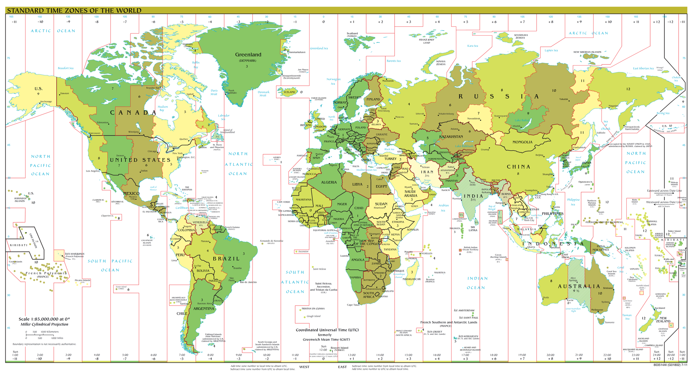

# สรุปสั้น ๆ เรื่องเขตเวลา (Time Zone) และไขข้อสงสัยว่าทำไมเวลาประเทศไทยถึงเป็น UTC+7 


*[Image from https://freepng.pictures/download/earth-planet-globe-world-3/](https://freepng.pictures/download/earth-planet-globe-world-3/)*

<blockquote class="ui-blockquote-heading">
    <h1>โลกนี้เป็นทรงกลม</h1>
</blockquote>

เพราะฉะนั้นวันเวลาที่เกิดขึ้นในแต่ละประเทศ แต่ละพื้นที่ทั่วโลก  **จะไม่เท่ากัน**
  
เลยมีการกำหนดเขตเวลา (Time Zone) มาตรฐานขึ้นมา 
เพื่อให้คนทั่วโลก ระบบต่าง ๆ ทั่วโลกเข้าใจตรงกันว่า 
ถ้าพูดถึงวัน/เวลาเท่านี้ในประเทศนึง จะมีค่าเท่ากับเท่าไหร่ในประเทศอื่น ๆ  

# ทบทวนเส้นลองจิจูด (Longitude)


*[Image from https://cdn.britannica.com/06/64906-050-675D6688/meridians-Facts-Lines-of-Longitude-angles-halves.jpg](https://cdn.britannica.com/06/64906-050-675D6688/meridians-Facts-Lines-of-Longitude-angles-halves.jpg)*

การกำหนดเขตเวลาจะใช้เส้นลองจิจูด หรือเส้นแนวตั้ง ช่วยกำหนดเป็นหลัก  

> ทั่วโลกเรามีเส้นลองจิจูด **360 เส้น (360 องศา)**
  
ถ้าผ่าตรงกลางโลก 
- จะอยู่ซีกซ้าย 180 เส้น (-180 องศา)   
- และซีกขวาอีก 180 เส้น (+180 องศา)
  
โดยเราถือว่าตรงกลางของโลก หรือลองจิจูดที่ 0 
ผ่ากลาง `กรีนิช ลอนดอน สหราชอาณาจักร (ประเทศอังกฤษ)`

# เขตเวลา (Time Zone)

กลับมาที่เขตเวลา 
  
พอเราเข้าใจเรื่องลองจิจูดแล้ว   
ทีนี้เค้าก็ใช้ประโยชน์จากลองจิจูด ในการช่วยกำหนดเรื่องเขตเวลา คือ
  
เค้ากำหนดให้ กรีนิช ลอนดอน สหราชอาณาจักร คือเวลาที่ 0  
ซึ่ง เราอาจจะคุ้น ๆ กันกับคำว่า **UTC (Universal Time Coordinated)** หรือ **UTC 0** 
  
จากนั้น เค้าก็กำหนดอีกว่า  
ให้ทุก ๆ ลองจิจูดที่เพิ่มขึ้น 15 องศา หรือ 15 เส้น (ทั้งซ้าย และขวา) จากลองจิจูดที่ 0   
**จะถูกบวกหรือลบ**เวลาเพิ่มเข้าไปครั้งละ 1 ชั่วโมง

### วิธีคิด 

```plaintext
ทุก ๆ 15 องศาเวลาจะเปลี่ยนไป 1 ชั่วโมง เพราะ
โลกเราเป็นทรงกลม
โลกหมุนรอบตัวเอง 1 รอบ เท่ากับ 1 วัน คือ 24 ชั่วโมง
การที่โลกหมุนรอบตัวเอง 1 รอบ มีค่าเท่ากับ 360 องศา 
```
เลยเป็นที่มาว่า

> 360 องศา / 24 ชั่วโมง = 15 องศา/ชั่วโมง นั่นเอง

ทำให้ในโลกนี้มีเขตเวลาเป็น 

- UTC (กรีนิช ลอนดอน สหราชอาณาจักร)
- UTC-1 ไปจนถึง UTC-12 และ
- UTC+1 ไปจนถึง UTC+14
  
โดยเขตเวลาประเทศไทยจะเท่ากับ  UTC+7  
เพราะลองจิจูดของไทยตั้งอยู่ที่ประมาณ +100 องศา  
พอเราลองเอา 100/15 ~= **6.66667** หรือ +7 ชั่วโมงนั่นเอง

# ตัวอย่างการคิดเวลา

สมมติว่า 
  
เวลาที่ กรีนิช ลอนดอน สหราชอาณาจักร หรือ เวลา UTC คือ 12:00 น. (คิดแบบ 24 ชั่วโมง)
  
เวลาในประเทศไทยซึ่งเป็น UTC+7 (ณ เวลาเดียวกัน) จะเท่ากับ 12:00 น. บวกไปอีก 7 ชั่วโมง ซึ่งก็คือ 19:00 น. นั่นเอง  
  
# ข้อยกเว้น

แต่เค้าก็มีข้อยกเว้นนิดนึง ว่า  
ไม่ใช่ว่าจะต้องใช้ลองจิจูดกำหนดเขตเวลาตายตัวขนาดนั้น  
เพราะแต่ละประเทศในโลกมันมีรูปร่างไม่เหมือนกัน   
บางประเทศอาจจะควบเวลาไป 2 - 3 เขตเวลา   
  
ก็เลยเป็นดังรูปด้านล่าง (ที่เส้นเขตเวลาสีแดงมันไม่ตรง)   ที่เราจะเห็นว่าบางประเทศเค้าก็ยุบรวมหรือใช้เขตเวลาเดียว   แทนการใช้หลายเขตเวลา
  
หรือบางประเทศเค้าก็มีการกำหนดไปเลยว่ารัฐนี้ เมืองนี้ใช้เขตเวลานี้น่ะ ทั้ง ๆ ที่มันอาจจะไม่ได้อยู่ในลองจิจูดที่กำหนด เพื่อที่คนในประเทศจะได้ไม่สับสนกัน



*[Image from https://www.wikiwand.com/th/เขตเวลา](https://www.wikiwand.com/th/เขตเวลา)*

# การตั้งชื่อเขตเวลา 

ทีนี้การที่จะให้คนจำเขตเวลาเป็น UTC-1, UTC+1, UTC+2, UTC+3, .... มันจำยาก 
  
เพื่อความสะดวกสบายมากขึ้น เค้าได้มีการตั้งชื่อเขตเวลาขึ้นมา สำหรับแต่ละประเทศแต่ละเมือง เพื่อให้คนจำได้ง่ายขึ้น 
  
เช่น ประเทศไทย แทนที่เราจะต้องจำเป็น `UTC+7` เราก็สามารถจำเป็น  `Asia/Bangkok` แทนได้ ซึ่งก็มีค่าเท่ากับ UTC+7 นั่นเอง 
  
### รายชื่อเขตเวลา (Time Zone) ทั้งหมดในโลก 

สามารถดูได้จาก 

- [https://www.wikiwand.com/en/List_of_tz_database_time_zones](https://www.wikiwand.com/en/List_of_tz_database_time_zones)


# ทำไมต้องเข้าใจเรื่องเขตเวลา

> เพราะเรื่องเขตเวลา (Time Zone) เป็นพื้นฐานในการเขียนโปรแกรม และการ Setup ระบบอย่างนึง 

ถ้าเราเขียนโปรแกรมถูก แต่ดัน Set เขตเวลา (Time Zone) ไม่ถูก ก็อาจจะทำให้ระบบแสดงผล ประมวลผลเรื่องวัน/เวลาไม่ถูกต้องก็เป็นได้ ซึ่งมันจะเป็นปัญหาเล็ก ๆ ที่ดูจะปวดหัวมาก เมื่อต้องมาตามแก้ไขในภายหลัง 

# ตัวอย่างการนำไปใช้ 

- [ตั้งค่า Time Zone สำหรับ Ubuntu 20.04 LTS](/blog/set-timezone-for-ubuntu20.04/)
- [ตั้งค่า Time Zone สำหรับ Java Spring-boot Reactive](https://github.com/jittagornp/spring-boot-reactive-example/tree/master/spring-boot-reactive-default-timezone)

# อ้างอิง

- [https://www.wikiwand.com/th/ลองจิจูด](https://www.wikiwand.com/th/ลองจิจูด)
- [https://www.wikiwand.com/th/เขตเวลา](https://www.wikiwand.com/th/เขตเวลา)

# อื่น ๆ 

อ่านเพิ่มเติมได้จาก Comment ด้านล่างครับ
